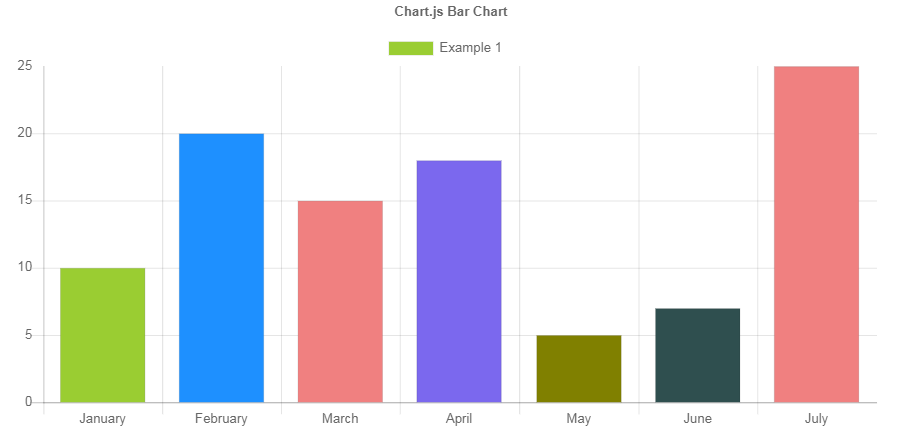
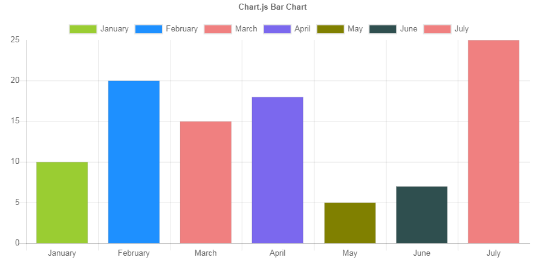

I want to share with you a small adjustment I made for my project with the bar chart in Chart.JS library.  
  
The result I wanted to achieve was to be able to filter specific bars from the chart.  
  
This is the original use with the legend that comes with ChartJS:  
jsFiddle https://jsfiddle.net/xkvoncth/1/  

  
The result I wanted:  
jsFiddle https://jsfiddle.net/ze7xwnLv/1/  

  
# Usage
  Place you data, labels and colors (not mandatory) using the globalData, globalLabels and globalColors variables.
  
# Explanation
Explanation regarding the solution:  
*A.* First I place all the data in global variables.  
We have 4 lists:
  1. Data- list of the data "the numbers"
  2. Labels- list of labels for X-axis labels
  3. Colors- list of colors, the bars getting their colors according to this list.
  4. isHidden- list of boolean, each boolean represents if the bar is hidden or not. The array first initialized with all 'false', since all the bars are shown at the begining.

```
let globalLabels = ['January', 'February', 'March', 'April', 'May', 'June', 'July']

const numberOfBars = globalLabels.length

let globalColors = ['#9ACD32', '#1E90FF', '#F08080', '#7B68EE', '#808000', '#2F4F4F', '	#F08080']

let globalData = [10, 20, 15, 18,5, 7, 25]

let globalHidden = []
for (let i = 0; i < numberOfBars; i += 1) {
	globalHidden.push(false)
}
```

*B.* In the options object, under the ledend -> labels attribute, I added a function called generateLabels. The function returns a list of items that will be the items inside the legend. This is a function that ChartJS give us and we can override it.  
The fields text, fillStyle, index and hidden are mandatory for the legend to be generated correctly.  
  
```
generateLabels: function (chart) {
	var result = []

	for (let i = 0; i < numberOfBars; i += 1) {
		result.push({
			text: globalLabels[i],
			fillStyle: globalColors[i],
			index: i,
			hidden: globalHidden[i]
		})
	}

	return result
}
```

*C.* Also under legend options, I added a function called onClick, this function runs every time user clicks legend item.  
     The main idea of the function, is to toggle the boolean that represents the bar in isHidden list and update the data that sits in the chart component. We reset the data inside the chart compnent and push new data, we basiclly filter bars that are hidden (using the list isHidden)  
  
```
onClick (e, legendItem) {
	var index = legendItem.index;
	let ci = this.chart
	// toggle boolean in isHidden
	globalHidden[index] = !globalHidden[index]
	// reset the data in chart compnent
	ci.config.data.datasets[0].data = []
	ci.config.data.datasets[0].backgroundColor = []
	ci.config.data.labels = []

	// push new data to chart compnent
	for (let i = 0; i < numberOfBars; i++) {
		if (globalHidden[i] === false) {
			ci.config.data.datasets[0].data.push(globalData[i])
			ci.config.data.datasets[0].backgroundColor.push(globalColors[i])
			ci.config.data.labels.push(globalLabels[i])
		}
	}
	ci.update()
}
```
  
 
